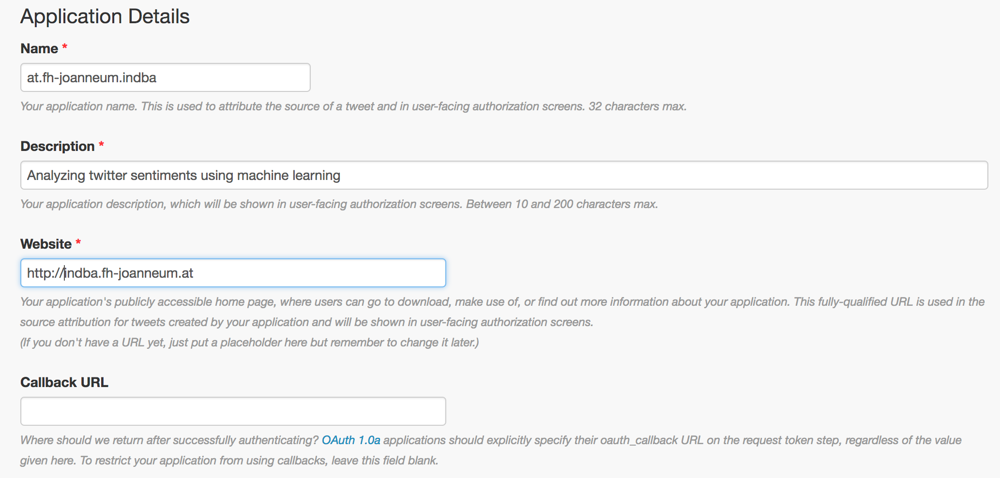
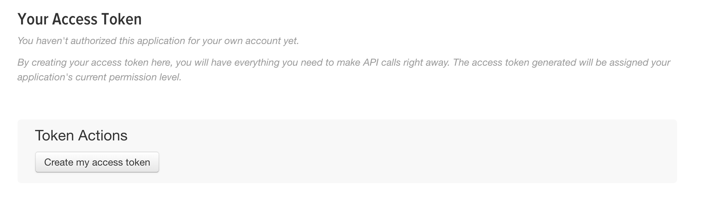
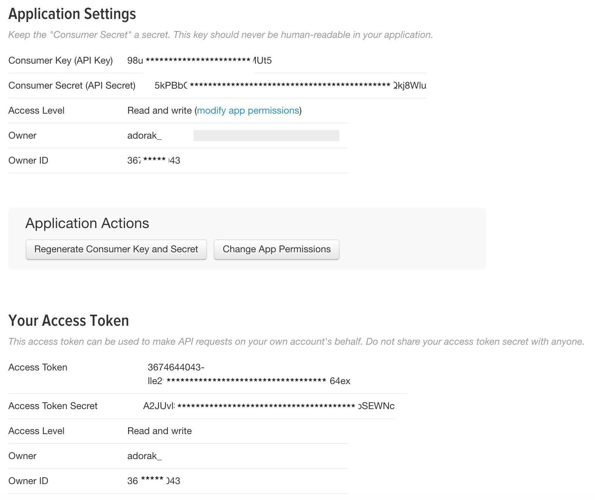

# Get Access to Twitter API
Before you can get any information from the Twitter API, an application has to be set up. Even for publically available tweets, this step is always mandatory.

### Step 1: Create a Twitter Account
Of course this step can be omitted if you already have an account.

### Step 2: Create API Application
Visit https://apps.twitter.com/ in order to create an APP. Click on *__create new app__* and fill out the form.

### Step 3: Create Access Token
Once the application has been created, you need to grant your twitter account access to this application.
Click on the tab "Keys and Access Tokens" and click the button *__Create my access token__*

### Step 4: Use key and token
The consumer key and access token are everything the application needs in order to access and use the Twitter API.

# *Done!*